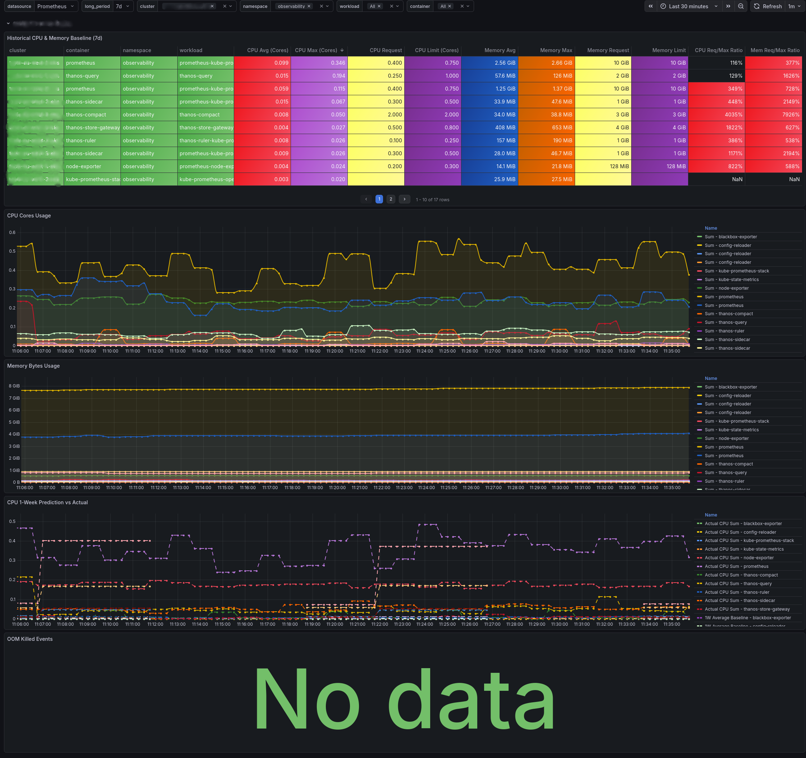

# Kubernetes Resource Optimizer & AI Assistant

A complete observability and automation stack to help you "right-size" your Kubernetes workloads. This repository contains heavily optimized Prometheus recording rules, a highly visual Grafana dashboard, and a Python-based AI assistant powered by Google's Gemini to generate automated tuning recommendations.



**Acknowledgments:**
> The Prometheus recording rules in this repository build upon the foundation provided by the excellent [arvatoaws-labs/k8soptimizer](https://github.com/arvatoaws-labs/k8soptimizer) project. We have adapted them for Thanos compatibility and multi-cluster environments.

---

## ✨ Key Features

* **AI-Powered Recommendations:** Feed your Prometheus telemetry directly into Google's Gemini LLM to receive instant, tailored CPU and Memory rightsizing recommendations formatted as a clean Markdown table.
* **Multi-Cluster & Thanos Ready:** Safely handles duplicate metric series and `group_left` cardinality issues common in federated Thanos environments.
* **Over-provisioning Heatmaps:** The Grafana table dynamically colors cells red or orange when a container's requested CPU or Memory heavily exceeds its historical maximum usage.
* **Historical Baselines:** Easily toggle between 1d, 3d, 7d, 14d, and 30d lookback windows to compare static configuration limits against actual historical traffic spikes.
* **Zero-Spam Dashboards:** Cleanly organizes everything by Cluster -> Namespace -> Workload -> Container.

---

## 🚀 Installation & Setup

### 1. Deploy the Prometheus Rules
To make the dashboard and AI script work, Prometheus needs to calculate the historical data. Apply the `prometheus-rules.yaml` file to your cluster.

⚠️ **CRITICAL: Check your Prometheus Operator Labels!**
Before applying the file, you must ensure the `release` label in the YAML matches your Prometheus Operator's `ruleSelector`. If they do not match, Prometheus will silently ignore the file.

Check your cluster's required label:
```bash
kubectl get prometheus -n <your-monitoring-namespace> -o yaml | grep -A 5 ruleSelector
```

Update the `metadata.labels` in the `prometheus-rules.yaml` file to match that output, then apply it:
```bash
kubectl apply -f rules/prometheus-rules.yaml
```

### 2. Import the Grafana Dashboard

* Open your Grafana instance.
* Navigate to **Dashboards -> New -> Import**.
* Upload the `k8soptimizer-dashboard.json` file from the `dashboards/` directory of this repo.
* Select your Prometheus or Thanos data source from the dropdown and click **Import**.

### 3. Setup the AI Optimizer Script (Optional)

The `k8s_ai_optimizer.py` script pulls metrics from your local Prometheus instance, formats them into a highly-compressed CSV payload, and streams tuning recommendations directly to your terminal.

**Prerequisites:**
Install the required Python libraries:
```bash
pip install -r requirements.txt
```

**Get an API Key:**
1. Go to [Google AI Studio](https://aistudio.google.com/) and create a free API key.
2. *Note: For corporate data privacy, ensure your AI Studio project is linked to a Google Cloud Billing account to access the Paid Tier.*
3. Export the key to your environment:
```bash
export GEMINI_API_KEY="your_api_key_here"
```

**Usage:**
Run the script to analyze your workloads. The script includes built-in filters to ignore tiny containers (<= 256MiB and <= 0.050 CPU) to save tokens.

```bash
# Analyze all clusters and namespaces
python k8s_ai_optimizer.py

# Analyze specific clusters
python k8s_ai_optimizer.py -c prod-eu-west-3-eks

# Analyze specific namespaces across multiple clusters
python k8s_ai_optimizer.py -c customer1-eks customer2-eks -n frontend backend
```

---

## 📊 How to read the Dashboard Heatmaps

The Historical Baseline table at the center of the dashboard does the heavy lifting for you using built-in ratio calculations:

* **Green/Transparent Background:** The workload is well-tuned. Resource requests are close to actual historical maximums.
* **Orange Background:** The workload is over-provisioned. The container is requesting up to 150% more resources than it has ever used in the selected time period.
* **Red Background:** Severe waste. The container is requesting more than 200% of its historical maximum usage.
* **Purple Text (Limits):** If the CPU or Memory Limit text turns purple, your hard limit is exactly equal to your maximum recorded usage, meaning the pod is likely being throttled or is at risk of an OOMKill during the next traffic spike.

---

## 🤝 Contributing

Feel free to open issues or submit pull requests if you have ideas to make the queries faster, the dashboard more intuitive, or the AI prompts more accurate!
